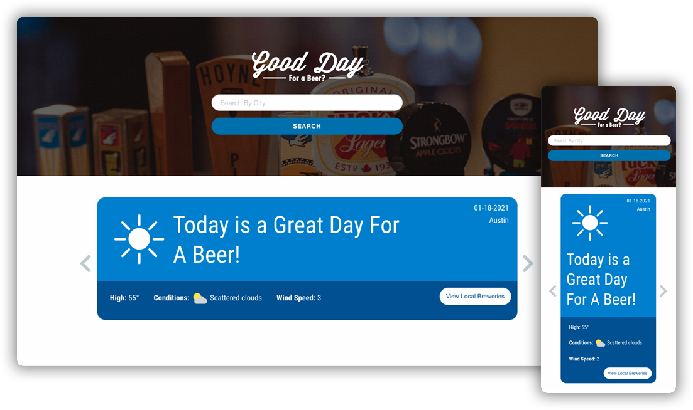

# Good Beer Day?

A simple wed application that allows you to view a five day forecast, based on the conditions it will tell you if it is or isn't a good day to enjoy a beer outdoors. On the days that are enjoyable, you can then choose to view local breweries information in your area. 

## User Story

```
AS A person that loves enjoying a beer outdoors on a beautiful day.,
I want to view which upcoming days is great to be outdoors.
So I can either make a spontaneous trip, or plan ahead which brewery(or breweries) to visit.
```


The following image demonstrates the application's functionality:

 

# Project on Github
**Respository** - https://bithub.com/reagang1997/INeedADrink

**Live** - https://reagang1997.github.io/INeedADrink


# Process - Technology Used 

## Zurb Foundation CSS Framework
Big use specifically of their grid system

## API's
**Weather Information**: https://www.weatherbit.io

**Brewery List**: https://www.openbrewerydb.org/

## Third Party Libraries
**Slick Slider**: https://kenwheeler.github.io/slick/

# Process - Roles 

## Angel Cooper 
Initial/ Static HTML & CSS

## Reagan Grunwald
JS logic Lead - API Calls, Local Storage, CLick Events etc.

## David Rojo
Porject Management & QA

Wireframes & Design Elements    

Third Party JS Library Integration

Final CSS styling and adjustments 


